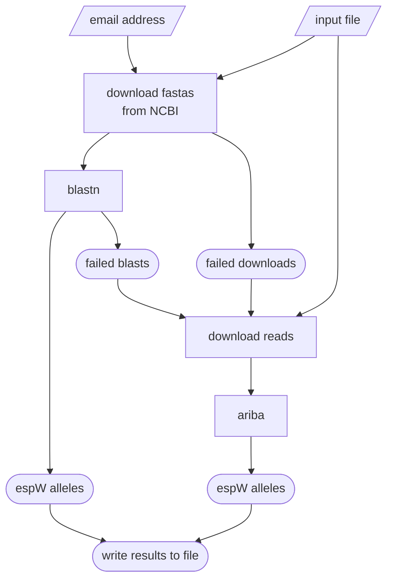

# _espW_ Allele Caller
A pipeline to atuomatically detect the allele of _espW_ in _E. coli_ genomes.

#### Joseph S. Wirth, 2023

## Overview
### Background
Recent investigations (publication forthcoming) identified a homopolymer of varying size in the _espW_ gene in _E. coli_ O157:H7 isolates. This pipeline is designed to determine which allele is present in an input genome.

### Workflow
The allele of _espW_ is determined as follows:

1. Three alleles of _espW_ (deletion, full length, and insertion) are used as queries to search against the input genome using `blastn`. The search strategy employed is capable of distinguishing which allele is present in the isolate.
2. If `blastn` is unable to determine the _espW_ allele, then `ariba` is used to recruit reads and assemble the _espW_ gene. The resulting assemblies are then screened to see if the _espW_ allele can be determined.
3. If _espW_ is not assembled by `ariba`, then `espwAlleleCaller` will report the allele as "absent". If _espW_ was assembled but the assembly did not allow for clear identification of the allele, then `espwAlleleCaller` will report the allele as "ambiguous".

Here is an overview of the workflow:


## Installation
### Installing `espwAlleleCaller` using a `conda` environment
* install `sratoolkit` as described [here](https://github.com/ncbi/sra-tools/wiki/01.-Downloading-SRA-Toolkit) (we used version 2.11.3)
* download the two required git repositories
```bash
git clone https://github.com/ncezid-biome/BIOME-scripts.git
git clone https://github.com/ncezid-biome/espwAlleleCaller.git
```
* set up the environment
```bash
echo "MISC_DIR = '$(pwd)/BIOME-scripts/misc-python-scripts/'" > ./espwAlleleCaller/miscDirectory.py
conda env create -f ./espwAlleleCaller/environment.yml
conda activate espwallelecaller
```

### Checking installation
Check the installation with the following command:

```bash
./espwAlleleCaller/espwAlleleCaller.py --check_env
```

If everything was installed correctly, the following message will be printed to screen:

```text

environment is suitable

```

## Running `espwAlleleCaller`
```text
usage:
    espwAlleleCaller.py [-ieosnvhc]

required arguments:
    -i, --in             [file] filename of a tab-separated file with three columns and no headers: key, ncbi accession, srr id
    -e, --email          [str] email address (used to query NCBI)

optional arguments:
    -o, --out            [file] filename to write the output
    -s, --seq_dir        [directory] the directory where sequence files where be downloaded (will be created if necessary)
    -n, --num_threads    [int] the number of threads to use for parallel processing
    -v, --version        print the version
    -h, --help           print this help message
    -c, --check_env      check that all dependencies are installed
```

## Software dependencies
* [ncbi-blast+](https://blast.ncbi.nlm.nih.gov/doc/blast-help/downloadblastdata.html)
* [sratoolkit](https://github.com/ncbi/sra-tools)
* [ARIBA](https://github.com/sanger-pathogens/ariba)
* [python3.9+](https://www.python.org/)
* [biopython](https://biopython.org/)
